# Using Prometheus and Grafana to monitor Hyperledger Fabric/IBM Blockchain Platform

## Architecture

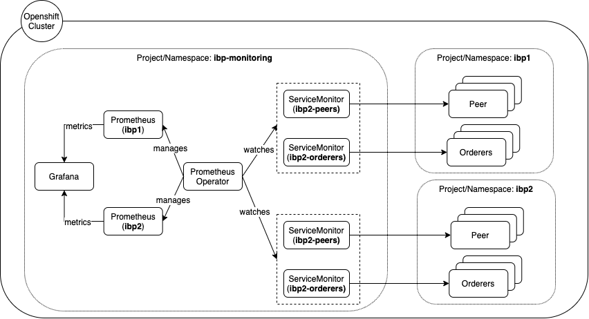

Two blockchain networks, resides in separate projects/namespaces, **ibp1** and **ibp2**. A separate project/namespace, **ibp-monitoring** is used to host monitoring tool pods/deployments. For each network, there is a separate `Prometheus` Custom Resource instance deployed by a common `Prometheus Operator`, which watches several `ServiceMonitor`s which maps to the operation endpoints of IBP/HF components. The `ServiceMonitor` will be reflected as configurations in the `Prometheus` instances

## Tutorial

In this tutorial, we will enable monitoring for 1 IBM Blockchain Platform network (**ibp**)

Note: This tutorial is tested in Openshift 4.3

### Prerequisities

1. Ensure an IBM Blockchain Platform network is deployed in the cluster
2. Ensure you are connected to the Openshift Cluster where IBP resides

### Register and enroll new users

Retrieving metrics from the peer and orderer requires mutual TLS authentication, so we need to generate certificate-key pairs for both the orderer organization and peer organization

1. In **IBP console**, go to **Nodes** > **org1ca** (the CA of the peer organization). Register a new user with enroll ID `monitoring`. Enroll this user against the **TLS Certificate Authority** and download the wallet. The file name of the wallet is assumed to be `org1mspmonitoring.json`

2. In **IBP console**, go to **Nodes** > **osca** (the CA of the orderer organization). Register a new user with enroll ID `monitoring`. Enroll this user against the **TLS Certificate Authority** and download the wallet. The file name of the wallet is assumed to be `osmspmonitoring.json`

   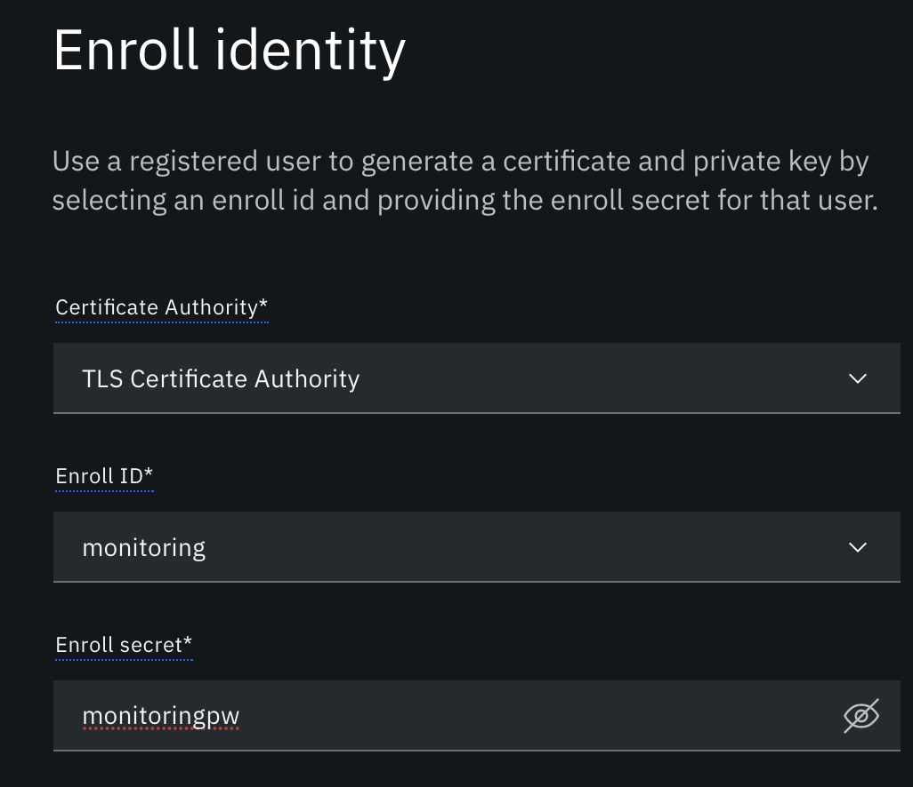

3. Decode the certificates and private keys:

   ```console
   jq -r .private_key org1mspmonitoring.json | base64 --decode > org1mspmonitoring.key
   jq -r .cert org1mspmonitoring.json | base64 --decode > org1mspmonitoring.pem
   jq -r .private_key osmspmonitoring.json | base64 --decode > osmspmonitoring.key
   jq -r .cert osmspmonitoring.json | base64 --decode > osmspmonitoring.pem
   ```

   Note that the name of the file should be in the format <MSP_ID>monitoring e.g. `org1mspmonitoring.key` and `org1mspmonitoring.pem` for subsequent scripts to work

### Retrieve peer and orderer address and scrape metrics manually

1. Export the peer information from IBP console
   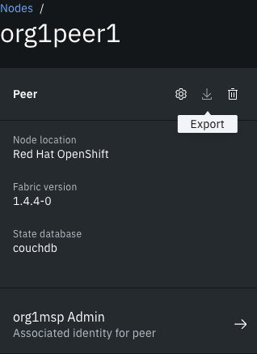

2. Retrieve the Operation URL of the peer

   ```bash
   PEER_FILE_NAME=org1peer1_peer.json
   PEER_ADDRESS=$(cat $PEER_FILE_NAME | jq -r .operations_url)
   echo $PEER_ADDRESS
   ```

3. Repeat the same process for the orderer

   ```bash
   ORDERER_FILE_NAME=orderer_orderer.json
   ORDERER_ADDRESS=$(cat $ORDERER_FILE_NAME | jq -r .[0].operations_url)
   echo $ORDERER_ADDRESS
   ```

4. Try to retrieve metrics from the peer and a bunch of metrics will appear. If you receive `curl: (35) error:1401E412:SSL routines:CONNECT_CR_FINISHED:sslv3 alert bad certificate` error, ensure that you have enrolled against `TLS Certificate Authority`

   ```console
   $ curl -k $PEER_ADDRESS/metrics --cert org1mspmonitoring.pem --key org1mspmonitoring.key -v
   ...
   # HELP promhttp_metric_handler_requests_total Total number of scrapes by HTTP status code.
   # TYPE promhttp_metric_handler_requests_total counter
   promhttp_metric_handler_requests_total{code="200"} 101
   promhttp_metric_handler_requests_total{code="500"} 0
   promhttp_metric_handler_requests_total{code="503"} 0
   * Connection #0 to host ibp-org1peer1-operations.mof-4667f5c54a9fa16798873d0072267a42-0000.sng01.containers.appdomain.cloud left intact
   ```

5. Try the same with ordering service

   ```console
   $ curl -k $ORDERER_ADDRESS/metrics --cert osmspmonitoring.pem --key osmspmonitoring.key -v
   ...
   # HELP broadcast_enqueue_duration The time to enqueue a transaction in seconds.
   # TYPE broadcast_enqueue_duration histogram
   broadcast_enqueue_duration_bucket{channel="channel1",status="SUCCESS",type="CONFIG_UPDATE",le="0.005"} 1
   broadcast_enqueue_duration_bucket{channel="channel1",status="SUCCESS",type="CONFIG_UPDATE",le="0.01"} 1
   broadcast_enqueue_duration_bucket{channel="channel1",status="SUCCESS",type="CONFIG_UPDATE",le="0.025"} 1
   broadcast_enqueue_duration_bucket{channel="channel1",status="SUCCESS",type="CONFIG_UPDATE",le="0.05"} 2
   * Connection #0 to host ibp-orderernode1-operations.mof-4667f5c54a9fa16798873d0072267a42-0000.sng01.containers.appdomain.cloud left intact
   ```

Now we are assured that the TLS certificate and key are correct and using those, the metrics are able to be scraped.

### Deploy Prometheus and Grafana Operators

 This section can be skipped if `prometheus-operator` exists in the `ibp-monitoring`. To check whether the Operators are installed, go to `Operators` > `Installed Operators`. Switch the project to `ibp-monitoring`. In the case below, there are no pre-existing operators in the project, thus the need to deploy
   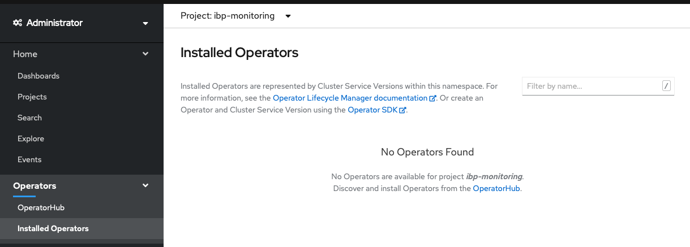

1. Create project `ibp-monitoring`

   This task can be skipped if project `ibp-monitoring` exists in cluster

   ```sh
   $ oc new-project ibp-monitoring
   Now using project "ibp-monitoring" on server "https://c101-e.jp-tok.containers.cloud.ibm.com:31704".
   ```

2. Deploy a Prometheus operator using OLM

   In `OperatorHub` tab, search for `Prometheus` and select `Install`
   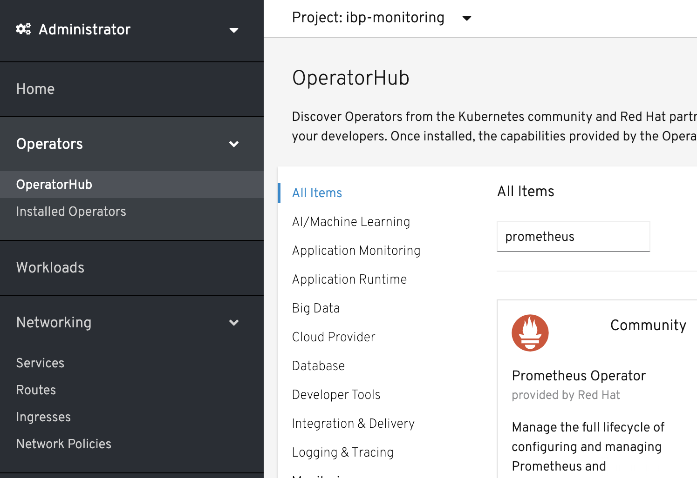

   Choose `ibp-monitoring` namespace and click `Subscribe`
   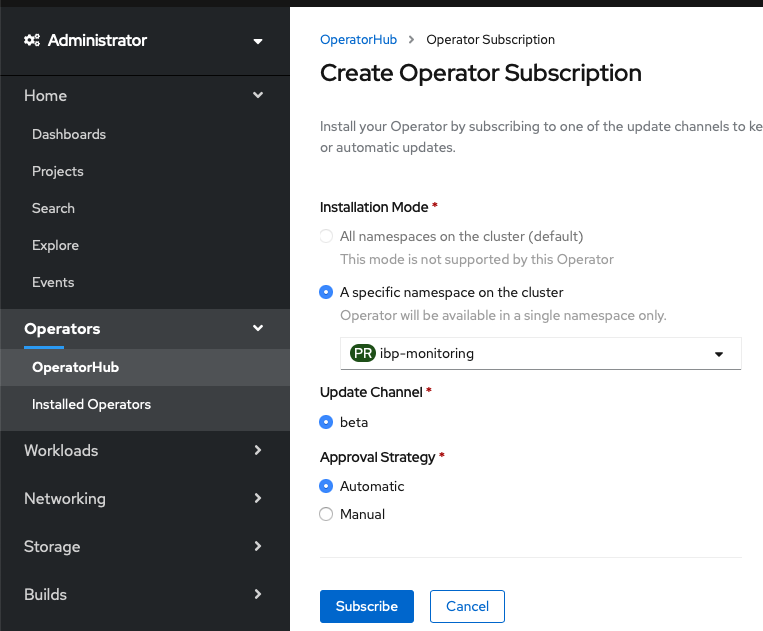

   After a few minutes, installation should succeed
   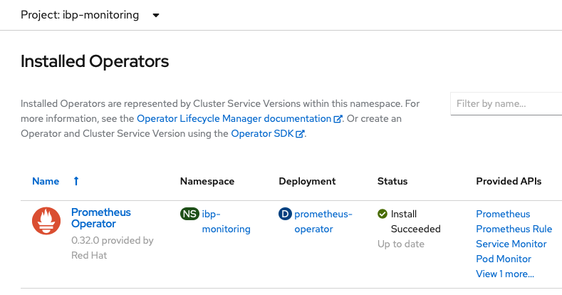

3. Deploy a Grafana operator using OLM

   This task can be skipped if `grafana-operator` exists in the project. Refer to above step for the instruction to check.

   In `OperatorHub` tab, search for `Grafana` and select `Install`
   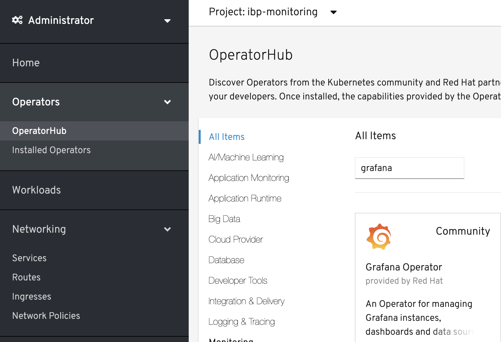

   Choose `ibp-monitoring` namespace and click `Subscribe`
   

   After a few minutes, installation should succeed
   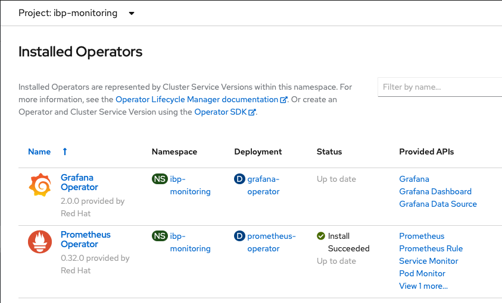

### Create Prometheus and supporting resources

Before deploying `Prometheus`, there are resources that must be deployed. In the subsequent steps, the project name is `ibp`

1. Create `Secret` which hosts the TLS certificate and key

   ```console
   $ oc create secret generic ibp-org1msp-monitoring-secret --from-file=cert.pem=./org1mspmonitoring.pem --from-file=key.pem=./org1mspmonitoring.key -n ibp-monitoring
   secret/ibp-org1msp-monitoring-secret created
   $ oc create secret generic ibp-osmsp-monitoring-secret --from-file=cert.pem=./osmspmonitoring.pem --from-file=key.pem=./osmspmonitoring.key -n ibp-monitoring
   secret/ibp-osmsp-monitoring-secret created
   ```

2. (Optional) Create `ClusterRole` to ensure that `Prometheus` instance has the correct privileges to scrape metrics

    Note: This task can be skipped if ClusterRole `prometheus-ibp` exists in cluster

   ```console
   $ oc apply -f clusterrole.yaml
   clusterrole.rbac.authorization.k8s.io/prometheus-ibp created
   ```

3. Create `Secret` for basic authentication of `Prometheus`. Remember the password that is set (use password: monitoring)

   As a form of standardization, use the format:  `prometheus-<project-name>-htpasswd`

   ```console
   $ htpasswd -s -c auth ibp
   New password:
   Re-type new password:
   Adding password for user ibp
   $ oc create secret generic prometheus-ibp-htpasswd -n ibp-monitoring --from-file auth
   secret/prometheus-ibp-htpasswd created
   ```

4. Generate `Prometheus` and its resources YAML definitions

   ```bash
   ./generate-prometheus.sh <project-name>
   ```

   Example:

   ```console
   $ ./generate-prometheus.sh ibp
   Environment variables:
   PROJECT NAME=ibp
   Create project folder 'proj-ibp'
   Convert template files to project folder 'proj-ibp'
   Done!!! Please view config files in folder 'proj-ibp'
   ```

5. Retrieve label and port for peer organization

   ```bash
   oc get svc --show-labels -l orgname -n <project-name>
   ```

   Example:

   ```console
   $ oc get svc --show-labels -l orgname -n ibp
   NAME        TYPE       CLUSTER-IP       EXTERNAL-IP   PORT(S)                                                       AGE       LABELS
   org1peer1   NodePort   172.21.167.79   <none>        7051:32230/TCP,9443:32484/TCP,8080:31825/TCP,7443:31925/TCP   41m       app.kubernetes.io/instance=ibppeer,app.kubernetes.io/managed-by=ibp-operator,app.kubernetes.io/name=ibp,app=org1peer1,creator=ibp,orgname=org1msp
   ```

   You will find `orgname=org1msp` and port `9443`. Take note of these values

6. Retrieve label and port for ordering service organization

   ```bash
   oc get svc --show-labels -l orderingservice -n <project-name>
   ```

   Example (If you have five ordering nodes, five will be displayed instead of one):

   ```console
   oc get svc --show-labels -l orderingservice -n ibp
   NAME                   TYPE       CLUSTER-IP       EXTERNAL-IP   PORT(S)                                                       AGE       LABELS
   orderernode1   NodePort   172.21.145.13   <none>        7050:31582/TCP,8443:30667/TCP,8080:31028/TCP,7443:31379/TCP   33m       app.kubernetes.io/instance=ibporderer,app.kubernetes.io/managed-by=ibp-operator,app.kubernetes.io/name=ibp,app=orderernode1,creator=ibp,orderingnode=node1,orderingservice=orderer,parent=orderer
   ```

   You will find `orderingservice=orderer` and port `8443`. Take note of these values. Also retrieve the MSP ID of the orderer organization which can be found by downloading the MSP file from IBP console. In this case, the MSP ID is `osmsp`

7. Generate `ServiceMonitor` files for peer and orderer organizations

   ```bash
   ./generate-service-monitor.sh <project-name> <msp> <port> <matchLabels>
   ```

   Example of peer organization:

   ```sh
   $ ./generate-service-monitor.sh ibp org1msp 9443 'orgname: org1msp'
   Environment variables:
   PROJECT NAME=ibp
   MSP=org1msp
   Convert service monitor template file to project folder 'ibp', MSP 'org1msp'
   Done!!! Please view config file at './proj-ibp/org1msp-servicemonitor.yaml'
   ```

   Example for orderer organization:

   ```sh
   $ ./generate-service-monitor.sh ibp osmsp 8443 'orderingservice: orderer'
   Environment variables:
   PROJECT NAME=ibp
   MSP=osmsp
   Convert service monitor template file to project folder 'ibp', MSP 'osmsp'
   Done!!! Please view config file at './proj-ibp/osmsp-servicemonitor.yaml'
   ```

8. Update `Prometheus` configuration to include previously created `Secret` and alter the `StorageClass` name

   ```bash
   cd proj-<project-name>
   vi prometheus.yaml
   ```

   In `secret` section replace `- <project-name>-<msp>-monitoring-secret` secret (under `htpasswd`) from Step 1

   Example:

   ```yaml
   - ibp-osmsp-monitoring-secret
   - ibp-org1msp-monitoring-secret
   ```

   Alter the `storageClassName` (for available Storage Classes, issue `oc get sc`):

   ```yaml
   storageClassName: portworx-sc
   ```

9. Create required `Secrets`:

   ```sh
   $ oc apply -f proj-ibp/secrets.yaml
   secret/prometheus-ibp-proxy created
   ```

10. Create `ServiceAccount` and `ClusterRoleBinding`:

    ```sh
    $ oc apply -f proj-ibp/serviceaccount.yaml
    serviceaccount/prometheus-ibp created
    $ oc apply -f proj-ibp/clusterrolebinding.yaml
    clusterrolebinding.rbac.authorization.k8s.io/prometheus-ibp created
    ```

11. Create `Service` and `Route`. TLS secret for prometheus proxy will be created automatically (Refer to <https://docs.openshift.com/container-platform/3.11/dev_guide/secrets.html#service-serving-certificate-secrets)>

    ```sh
    $ oc apply -f proj-ibp/service-route.yaml
    service/prometheus-ibp created
    route.route.openshift.io/prometheus-ibp created
    ```

12. Create `Prometheus` instance

    ```sh
    $ oc apply -f proj-ibp/prometheus.yaml
    prometheus.monitoring.coreos.com/ibp created
    ```

13. Create `ServiceMonitor` for Ordering service and Peer

    ```bash
    oc apply -f proj-ibp/<msp>-servicemonitor.yaml
    ```

    Example:

    ```sh
    $ oc apply -f proj-ibp/osmsp-servicemonitor.yaml
    servicemonitor.monitoring.coreos.com/ibp-osmsp created
    $ oc apply -f proj-ibp/org1msp-servicemonitor.yaml
    servicemonitor.monitoring.coreos.com/ibp-org1msp created
    ```

14. After `Prometheus` pod is running (issue `oc get pod`), trigger configuration refresh manually

    ```sh
    oc exec prometheus-<project-name>-0 -c prometheus -n ibp-monitoring -- curl -X POST http://localhost:9090/-/reload
    ```

    Example:

    ```sh
    oc exec prometheus-ibp-0 -c prometheus -n ibp-monitoring -- curl -X POST http://localhost:9090/-/reload
    ```

15. Visit `Prometheus` endpoint and login using Openshift credential. To retrieve address:
  
    ```bash
    echo "https://$(oc get routes prometheus-<project-name> -n ibp-monitoring -o json | jq -r .spec.host)"
    ```

    Example:

    ```bash
    echo "https://$(oc get routes prometheus-ibp -n ibp-monitoring -o json | jq -r .spec.host)"
    ```

16. Go to **Status** > **Targets** and a similar screen should be shown:

   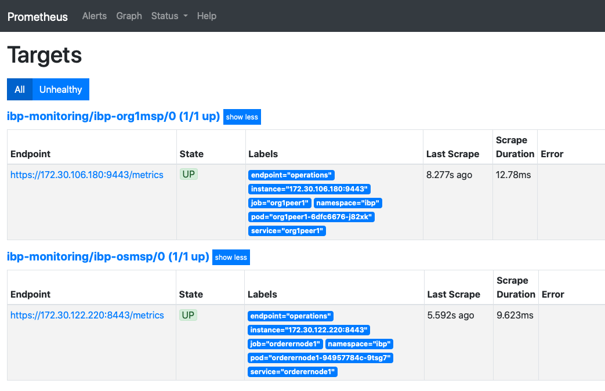

### Create Grafana and supporting resources

1. Deploy `Grafana` (Skip if Grafana is already deployed in `ibp-monitoring`)

   ```sh
   $ oc apply -f ./grafana-config/ibp-grafana.yaml
   grafana.integreatly.org/ibp-grafana created
   ```

   Verify that Grafana is installed in OperatorHub
   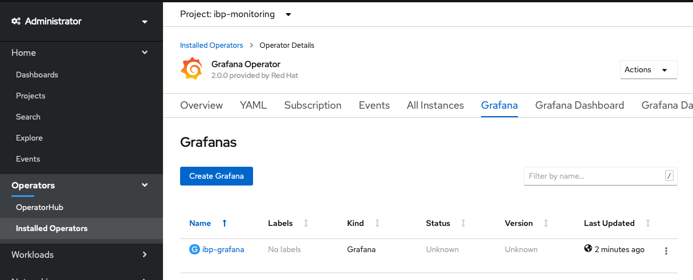

2. Create `Grafana Data Source (Prometheus)`

   ```sh
   $ oc apply -f proj-ibp/prometheus-datasources.yaml
   grafanadatasource.integreatly.org/ibp-prometheus-datasources created
   ```

    Verify that Grafana Data Source is added in OperatorHub

   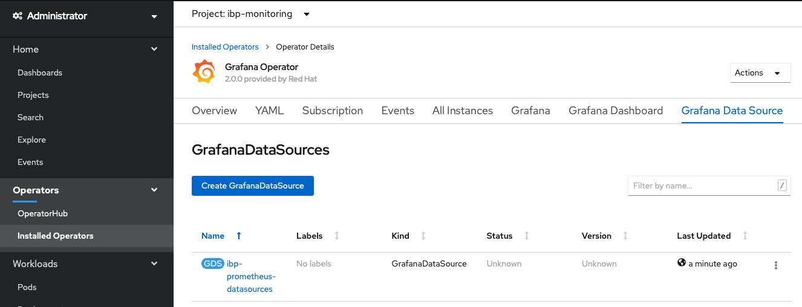

3. Visit grafana endpoint and login using Openshift credential. To retrieve address:
  
   ```bash
   echo "https://$(oc get routes grafana-route -n ibp-monitoring -o json | jq -r .spec.host)"
   ```

4. Test whether the prometheus data source is working

   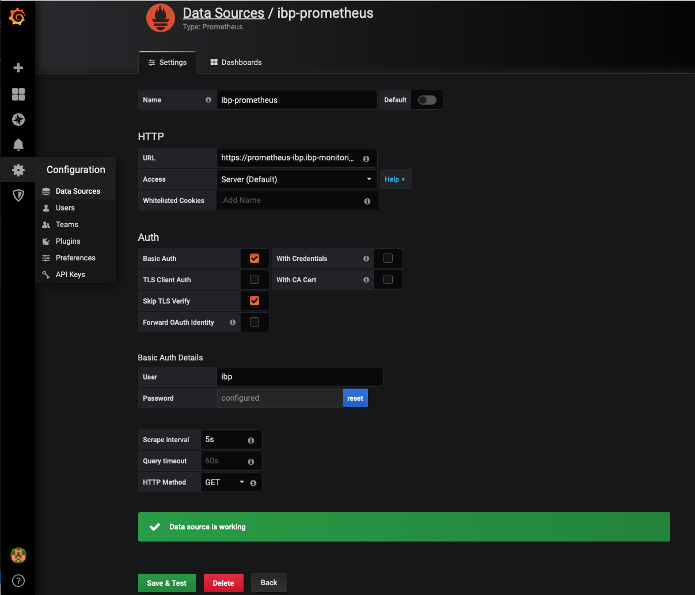
